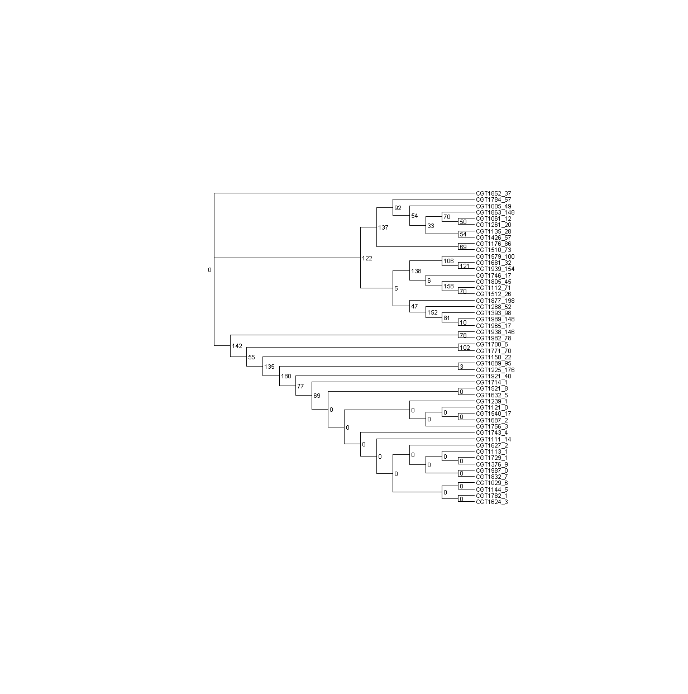
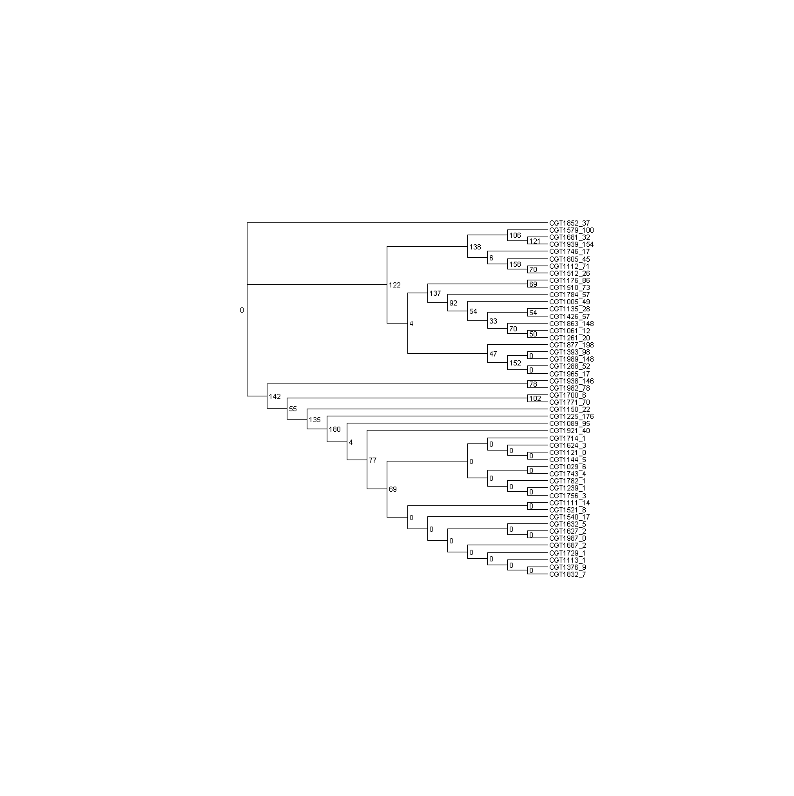
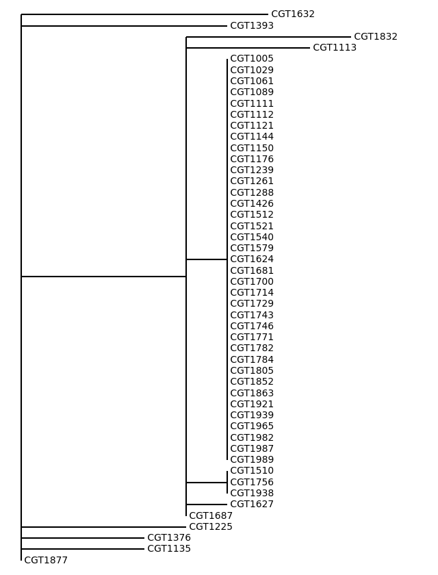
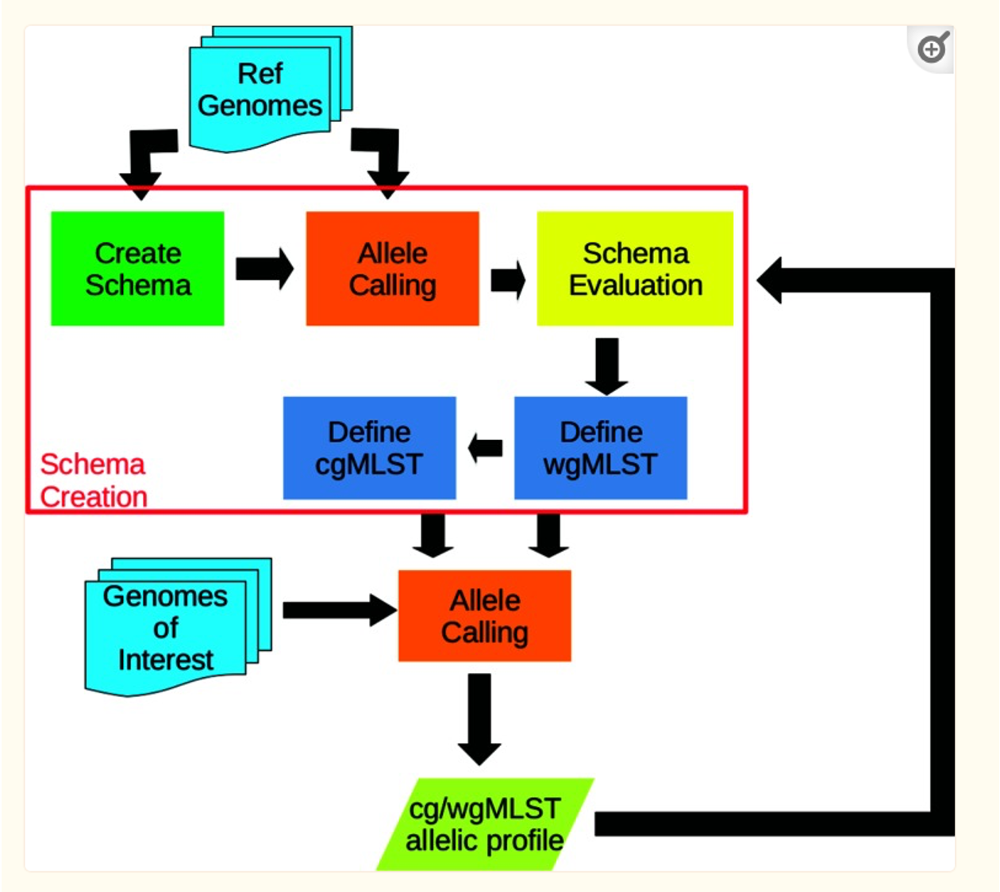
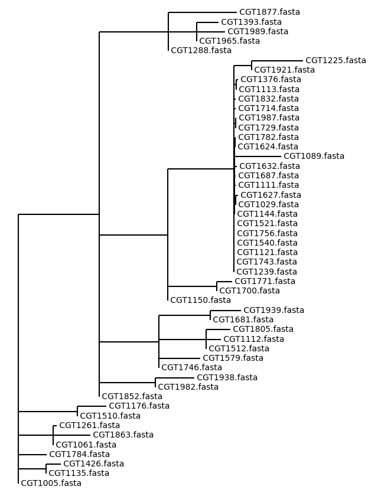

# Team1-ComparativeGenomics
## Members
Kaiqin Bian, Rakin Choudhury, Upaasana Krishnan, Mariam Nawaz, Geetha Priyanka Yerradoddi, Wang Zun
## FastANI:
FastANI is a tool that calculates the fast alignment-free computation of whole-genome Average Nucleotide Identity (ANI). ANI is defined as the mean nucleotide identity of orthologous gene pairs shared between two microbial genomes. FastANI supports pairwise comparison of both complete and draft genome assemblies. 
Input - Assembled fasta sequences
Output - ANI matrix, Newark file, Calculated Identity file

### Download:
An easy option to install fastANI in the provided server environment (T1G4_CG2) is conda install.
``` 
conda install -c bioconda fastANI 
```

### Usage:
To know the available command-line options, version, and software usage.
```
./fastANI -h
```
There are many options to run the command on Linux terminal. For more information, you can check the fastANI developers' GitHub page here.
In our project, we would like to run multiple assembled fasta files against multiple reference genomes. Many to Many. 
```
fastANI --ql [queryfasta_list.txt] --rl [reference_list.txt] -o [output_file]
```
Output_file = <output_file.out>

### Visualization:
For visualization purposes, we used two R scripts, fastANI2tree.R and fastANI_heatmap.R.
To run the scripts:
For the phylogenic tree visualization, we need nwk format from the output file of fastANI run.
```
Rscript fastANI2tree.R <output_file.out> tree.nwk
```
We can visualize the tree using MEGA software. Output using MEGA software is attached below:


Another way to visualize the tree is using an online GUI website called ETI Toolkit, you can open the website here. Output from this tool is attached below:


For the heatmap visualization, we used the output file from the first fastANI run. 
```
Rscript fastANI_heatmap.R 
```
Heatmap output from the Rscript is attached below:


## MUMmer
MUMmer: An algorithm that can rapidly align large DNA sequences to one another. It can align whole genomes, large genome assemblies, partial genome sequences, and/or a set of reads to a genome.

Dnadiff: A wrapper around nucmer (the primary aligning algorithm used by MUMmer) that’s designed to evaluate the sequence and structural similarity of two highly similar sequence sets. It has multiple output files, but the ‘<filename>.report’ file contains the summary of alignments, differences, and SNPs. 

### Installation:
We installed MUMmer through conda into our conda environment (T1G4_CG2) on the server:
``` 
conda install -c bioconda mummer 
```

### Usage:
The following is a typical command for dnadiff:
``` 
dnadiff genome1.fasta genome2.fasta outfile 
```
The ouput consists of multiple files, including a outfile.report file. The 19th line has the 1:1 average identity between the two sequences.  

The Python script used to run dnadiff is designed to search for contigs.fasta from the Genome Assembly group and runs in parallel (given a number of threads to use) to reduce the running time. The script's usage is below:
``` 
python dnadiff_module.py input_dir output_dir matrix_filename thread_count
```
### Output & Visualization:
The final output is a txt file of the matrix of average identity between the supplied sequences. This matrix can then be used with software like R to visualize the results through heatmaps and dendrograms. 

For R, run the following commands to generate a heatmap (the pheatmap package is used here, but other heatmap functions can be used as well):
``` 
data_frame <- read.table(‘outfile.txt’)
pheatmap(as.matrix(data_frame)
```
The heatmap generated is given below (you can change the fontsize using cex). Its clusters were generated using the distance matrix (Euclidean). 20 of the isolates within the red boxes are ones we suspect to be part of an outbreak:


To extract the dendrogram from the heatmap, first save the heatmap as an object and run the following commands:
``` 
heatmap1 <- pheatmap(as.matrix(data_frame)
plot(heatmap1$tree_row, hang=-1)
```
The dendrogram generated is given below (you can change the fontsize using cex). The dendrogram's clusters were generated using the distance matrix (Euclidean). 20 of the isolates within the red boxes are ones we suspect to be part of an outbreak:


## kSNP3.1
kSNP is a SNP discovery and annotation tool which identifies pan-genome SNPs in a set of genome sequences and estimates phylogenetic trees based on those SNPs. It is based on k-mer analysis and doesn't require a reference genome or multiple sequence alignment. Therefore, it can take 100's of microbial genomes as input and those could be finished or unfinished genomes in assembled or unassembled reads. Finished and unfinished genomes can be analyzed together. For annotation, kSNP automatically download the Genbank files of the finished genomes and incorporate information from those files.

### Installation of kSNP
```
wget https://sourceforge.net/projects/ksnp/files/kSNP3.1_Linux_package.zip
unzip kSNP3.1_Linux_package.zip
vi ~/.bashrc
export PATH=$PATH:/path/to/kSNP3.1_Linux_package/kSNP3
source ~/.bashrc
which tcsh
copy the tcsh path
cd /path/to/kSNP3.1_Linux_package/kSNP3
vi kSNP3
set the shebang line to: #!/copied/path/of/tcsh/starting/from/home
set kSNP=/path/to/kSNP3.1_Linux_package/kSNP3
close the terminal and re-open
```

### Usage
**Step 1**: Create a text file containing path and GenomeID of all the genome sequence files. There are several ways to do that are given in the [kSNP User Manual](https://sourceforge.net/projects/ksnp/files/kSNP3.1.2%20User%20Guide%20.pdf/download). Format should be:
```
Path/to/the/1st/sequence/file	1-tabspace	 GenomeID
Path/to/the/2nd/sequence/file	1-tabspace	 GenomeID
```

**Step 2**: Create a combined Fasta file which will be input for the next step of determing optimal k-mer
```
MakeFasta <in_list.txt> <outfile_name.fasta>
```
where in_list.txt is the file from step 1.

**Step 3**: Finding optimal k-mer size
To identify a SNP, kSNP matches k-mers between different genomes and if they are identical except for the central base, it is counted as a SNP. The utility program is Kchooser.
```
Kchooser outfile_name.fasta
```

**Step 4**: Open the Kchoose.report and find the optimum value for k-mer.

**Step 5**: Run kSNP3
```
kSNP3 -in <in_list.txt> -outdir <outdir> -k <optimal_k-mer> -ML -NJ -CPU <number_of_CPUs> 
```

### Phylogenetic Trees
kSNP generates different form of phylogenetic tree files using Parsimony, Maximum likelihood (ML), and Neighbor joining (NJ) methods. Below are the tipAlleleCounts ML and NJ trees from the kSNP (step 5 above) visualized using [dendroscope](https://uni-tuebingen.de/fakultaeten/mathematisch-naturwissenschaftliche-fakultaet/fachbereiche/informatik/lehrstuehle/algorithms-in-bioinformatics/software/dendroscope/).

Phylogenetic tree using the Maximum likelihood method. The internal nodel labels show the number of SNP alleles that are present in all descendants of that node and nowhere else. Allele counts for branch tips are not shown. Strain names have been modified to show the strain specific allele counts:


Phylogenetic tree using the Neighbor joining method:


## StringMLST
This is a kmer based tool of finding MLST from raw geneome reads. StringMLST predicts the Sequence Type from the 7 houseekeeping genes with assembly and alignment free.

### Installation
For stringMLST itself:
``` 
conda install -y -c bioconda stringmlst
```
For tree drawing:
``` 
pip3 install grapetree
pip3 install plottree
```
### Usage:
The first step is to download the database for the selected genome, and in this case Salmonella Enterica. To choose a kmer size, the size of the kmer is optimized when it is half the size of the raw input. The P flag is the prefix for the database files.
 ``` 
stringMLST.py --buildDB -k 133 -P Salmonella/se
```
The second step is to predict the sequence type of the isolates using the 7 house keeping genes. The list.txt file contains the location of the paired reads.
 ``` 
stringMLST.py --predict -l list.txt -P Salmonella/se -k 133 -o result.txt
```
The result of stringMLST will be stored in the output txt or tsv. Then use grapetree and plottree, a tree would be plotted.
 ``` 
grapetree --profile ./result.txt --method NJ > stringMLST.nwk
plottree stringMLST.nwk -l 8.4 -o stringMLST
```
The result is a png file, which is displayed below.

 
 
## chewBBACA
### Usage
This is a gene-by-gene tool for MLST, compares the draft genome against a pre-defined schema using blastp. Its workflow is shown in the following figure including (1) schema creation with reference genomes, (2) allele calling using cg/wgMLST profile, (3) schema valuation.
 

### Installation:
 ``` 
pip3 install chewbbaca
 ``` 
Other options: 
 ``` 
 conda install -c bioconda blast	
 ``` 
or
``` 
 conda install -c bioconda prodigal 
 ``` 
### Usage
1. Download database Salmonella enterica
 ``` 
chewBBACA.py DownloadSchema -sp 8 -sc 1 -o SE
mv SE/* SE_db
rm -r SE
 ``` 

2. Allele calling
``` 
chewBBACA.py AlleleCall -i "+fasta_dirname+" -g SE_db -o AC --cpu 4 --ptf SE_db/Salmonella_enterica.trn
	mv AC/* ACresults
	rm -r AC
``` 
	
3. Quality check
  ``` 
chewBBACA.py TestGenomeQuality -i ACresults/results_alleles.tsv -n 1 -t 100 -s 5 -o QC
 ``` 
4. Extract loci in 95% matrix
 ``` 
 chewBBACA.py ExtractCgMLST -i ACresults/results_alleles.tsv --r ACresults/RepeatedLoci.txt --g QC/removedGenomes.txt -o output --t 0
``` 
	
### Output and Vitualization:
MSTreeVs method is utilized to visualize the output from chewBBACA.	
 ``` 
grapetree --profile output/cgMLST.tsv --method MSTreeV2 > result.nwk
plottree result.nwk -l 8.4 -o chewbbaca_tree
 ``` 
	

	
Output of chewBBACA can also be visualized by online GUI website Phyloviz using cgMLST.csv as profile and create axuiliary manually.

This is the output aligned color by locations.

This is the output aligned color by food types.


  
## AMRfinder


This software and the accompanying database identify acquired antimicrobial resistance genes in bacterial protein and/or assembled nucleotide sequences as well as known resistance-associated point mutations for several taxa. With AMRFinderPlus we added select members of additional classes of genes such as virulence factors, biocide, heat, acid, and metal resistance genes.

### Installation:
We installed AMRfinder through conda into our conda environment (T1G4_CG2) on the server. The prerequisites BLAST+, HMMER, and libcurl are included in the conda installation.
``` 
conda install -y -c bioconda -c conda-forge ncbi-amrfinderplus 
```

### Usage:
The following is a typical command for amrfinder:
``` 
amrfinder -n contigs.fasta --plus  --organism Salmonella > amr_out.txt 
```

### Output
The output of the tool is captured in a document and it contains information about the AMR and virulent genes identified


AMR and Virulence genes identified by AMRfinder


 * The first-line treatment for salmonella infections are fluoroquinolones, such as ciprofloxacin, and azithromycin. 
 * Third-generation cephalosporins are also effective, and often they are the first antibiotic given if a salmonella infection is suspected but not confirmed.
 * S. Typhi rapidly acquires resistance to the antimicrobials that are being used in the community, but can also lose resistance once these drugs are withdrawn.
 * Macrolides and Carbapenems are recommended treatments for drug resistant Salmonella infections.

## Recommended Course of Action for the CDC & Other Entities

For the CDC:
1. Trace the source of the suspected item(s) to their distributors and investigate the storage/distribution centers of their locations (California, Oregon, & Washington). Test for Salmonella.
2. Based on the tests' results, issue a recall on any batches that are suspected/confirmed to be contaminated. 
3. Post guidelines to restaurants, grocery stores, and other entities as well as individuals to prevent further purchases of affected item(s) and the proper steps in handling them.
4. Temporarily shut down affected center(s) and undergo steps the clean the area of Salmonella.
  
For other entities and individuals: Dispose of unlabeled onions and any that are from the suspected source and thoroughly clean their containers/storage locations. Do not buy any of the above items sourced from the suspected location(s). 

CDC’s General Guidelines to Prevent Salmonella Infection:
1. Regularly clean your hands, cooking utensils, and surfaces.
2. Keep raw foods away from meats (raw meat, poultry, and seafood)
3. Use a cooking thermometer to ensure cooked foods are at a proper temperature - Beef/Veal/Lamb/Pork: 145 ⁰F, Fish: 145 ⁰F, Ground Meats: 160 ⁰F, Poultry: 165 ⁰F, etc.
4. Refrigerate perishable food within 2 hours and always thaw in the refrigerator. Refrigerator should be 40 ⁰F or below and the freezer should be 0 ⁰F or below.

Recommended Antibiotics: Macrolides and Carbapenems are recommended treatments for drug resistant Salmonella infections.

## References:
1. Marçais G, Delcher AL, Phillippy AM, Coston R, Salzberg SL, Zimin A. MUMmer4: A fast and versatile genome alignment system. PLoS Comput Biol. 2018;14(1):e1005944. Published 2018 Jan 26. doi:10.1371/journal.pcbi.1005944.
2. R Core Team (2021). R: A language and environment for statistical computing. R Foundation for Statistical Computing, Vienna, Austria. URL https://www.R-project.org/. 
3. Raivo Kolde (2019). pheatmap: Pretty Heatmaps. R package version 1.0.12.https://CRAN.R-project.org/package=pheatmap. 
4. Four Steps to Food Safety: Clean, Separate, Cook, Chill. Center for Disease Control and Prevention. Last updated March 4, 2022. Accessed April 21, 2022. https://www.cdc.gov/foodsafety/keep-food-safe.html. 
5. CDC Food Safety Alert: Whole onions identified as the source of large ongoing Salmonella outbreak. Center for Disease Control and Prevention. Last updated October 21, 2021. Accessed April 21, 2022. https://www.cdc.gov/media/releases/2021/s1020-food-safety-salmonella.html.
  
